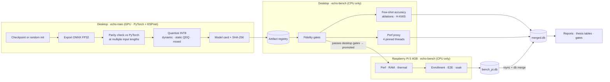
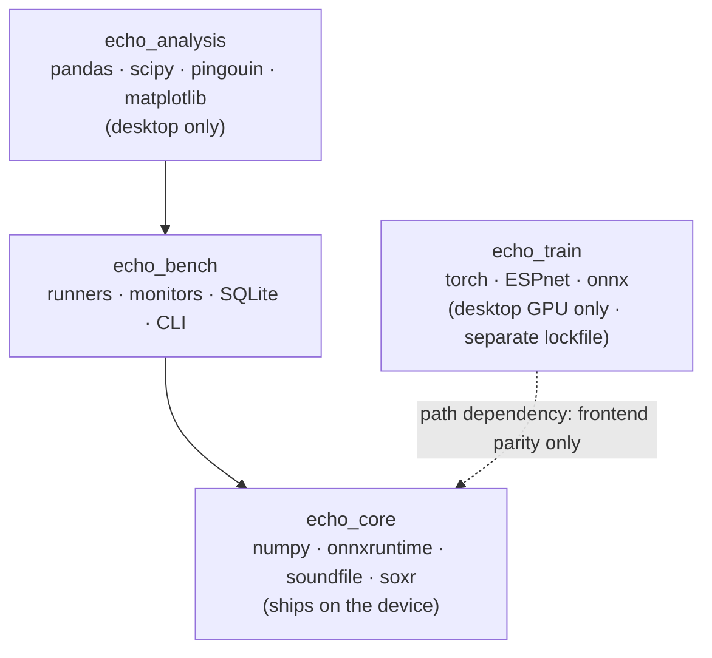
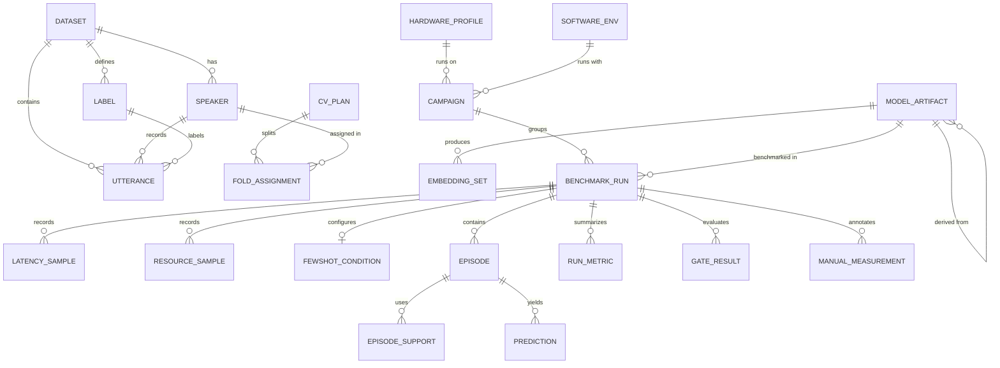

# ECHO-Bench — Project Blueprint

**Desktop-first benchmarking harness for the ECHO INT8 E-Branchformer, promoted to Raspberry Pi 5 (4 GB)**

| | |
|---|---|
| Project | ECHO: Edge-based Communication for Hierarchical Offline Intent Recognition |
| Document | Architecture blueprint, v1.0 |
| Date | 24 September 2026 |
| Status | Proposed. Confirm the assumptions in §1.4 before starting M0. |
| Traceability | Gates map to SO1–SO5 and Sections 1.7.4, 1.7.5 and 1.7.8 of the proposal manuscript |

---

## 0. TL;DR

1. **One inference package, two machines.** `echo_core` holds the frontend, ONNX Runtime session, prototypical classifier, H-KWS interface and enrollment logic. It runs unchanged on the desktop and on the Pi, and `echo_bench` drives it. The Pi never installs PyTorch.
2. **The desktop proves correctness and the Pi proves performance.** The desktop covers export parity, INT8 fidelity and few-shot accuracy. The Pi covers latency, RAM, thermals and power. A model artifact counts for official Pi numbers only after it passes the desktop gates.
3. **Store raw observations first and derive metrics later.** Latency samples, per-query distance vectors and resource traces go into SQLite. Every metric and thesis table is recomputed from them, so re-analysis never needs re-inference.
4. **The MVP can start before training finishes.** Latency, RAM and file size are properties of the architecture. A randomly initialised ~12M-parameter E-Branchformer can test the ≤16 MB and ≤1.5 s targets on both machines this week.

---

## 1. Scope and guiding principles

### 1.1 In scope

- Export and quantization fidelity: PyTorch FP32 → ONNX FP32 → ONNX INT8 (dynamic, static QDQ, mixed precision).
- Architecture-level performance on desktop and Pi: latency versus input length, session load time, peak RAM, CPU, thermals and power.
- The few-shot accuracy protocol: speaker-independent baseline and K ∈ {3, 5, 10}, plus Ablations 2, 3, 4 and 6.
- H-KWS evaluation and the SO2 error-cascade analysis.
- On the Pi: enrollment timing, end-to-end pipeline latency (SO5) and a sustained-load soak test.
- Thesis reporting: the Table 5 N-K matrix, paired t-test, RM-ANOVA, χ²/Fisher, and a pass/fail gate dashboard.

### 1.2 Out of scope for this harness

- **Encoder training.** It lives in `echo-train`, and the harness only consumes exported artifacts.
- **Administering the MOS listening test.** Ratings can be imported later as manual measurements.
- **GUI implementation.** GUI memory and CPU overhead are measured in PRO3 soak runs with the real app.
- **Running Ablations 1 and 5 (Whisper, MMS) on the Pi.** Their accuracy runs happen on the desktop. They can use the same artifact registry if on-device latency is ever needed.

### 1.3 Principles

| ID | Principle | Consequence |
|---|---|---|
| P1 | Benchmark what you ship | The harness imports `echo_core`, the same code the device app will run. There is no benchmark-only reimplementation. |
| P2 | Desktop proves correctness; Pi proves performance | Desktop latency is only a proxy and is never reported as a Pi number. |
| P3 | Raw first, metrics later | Distance vectors, latency samples and resource traces are persisted, and metrics are derived offline. |
| P4 | Never touch disk inside a timed region | Samples are buffered in memory and flushed to SQLite between measurement blocks. |
| P5 | Everything is identified by content | Model files are identified by SHA-256, configs by a canonical JSON hash, and environments by a fingerprint. |
| P6 | Offline-first, privacy by design | No cloud experiment trackers. Participant data stays in restricted storage per Section 1.7.10.3 and RA 10173. Only pseudonymous speaker codes are stored. |

### 1.4 Assumptions to confirm

| ID | Assumption | If it is wrong |
|---|---|---|
| A1 | The encoder is ESPnet's `EBranchformerEncoder` (`espnet2.asr.encoder.e_branchformer_encoder`), the reference implementation from the E-Branchformer authors. | Only `packages/echo-train` changes. The bench side consumes ONNX plus a model card, regardless of framework. |
| A2 | The deployable network is encoder + pooling (+ optional projection), producing one utterance embedding. Prototype distances are computed outside the graph in NumPy because prototypes are per-user and dynamic. | Change the model card `io` block and `echo_core.embed`. |
| A3 | H-KWS runs on acoustic features before the encoder (Section 1.7.4.3) and sits behind a pluggable interface. This blueprint does not fix its algorithm. | None; the interface accepts either features or frame embeddings. |
| A4 | The 36-intent participant corpus arrives later, likely in PRO3. The protocol runs first on TORGO/UASpeech with identical code. | None; the only difference is the dataset adapter. |

---

## 2. System overview

### 2.1 Two-stage flow



### 2.2 Package layering



Dependency rule, enforced by a test: `echo_core` and `echo_bench` must never import `torch`, `espnet`, `librosa` or `pandas`.

---

## 3. Tech stack

### 3.1 Platform matrix

| | Desktop | Raspberry Pi 5 (4 GB) |
|---|---|---|
| OS | Ubuntu 24.04 LTS, native or WSL2. Native Windows is fine for fidelity and accuracy runs only (no sysfs monitors, and its perf numbers are indicative). | Raspberry Pi OS Lite 64-bit (current Debian 13 base) |
| Python | CPython **3.12.x**, installed by `uv` | CPython **3.12.x**, installed by `uv`. Do not use the system Python (3.13). |
| Role | Training/export, fidelity, accuracy, perf proxy, analysis | Official perf, RAM, thermal, power, enrollment, E2E and soak numbers |
| Required setup | Record the CPU model. Pin 4 cores for perf-proxy runs (`taskset -c 0-3`). | Official Active Cooler. Official 27 W PSU for baseline runs, plus the power-bank → PD-board chain for field-representative runs. |

**Why Python 3.12:** NumPy 2.5 and SciPy 1.18 require ≥3.12. ESPnet 202610 supports 3.12–3.13. onnxruntime, torch, onnx, kaldi-native-fbank and soxr all publish `aarch64` cp312 wheels. Pinning 3.12 through `uv` gives both machines the same interpreter regardless of the OS default.

### 3.2 Environments and pinned versions

These are the versions current on PyPI as of 24 Sep 2026. `uv lock` produces the lockfile, which is the source of truth.

**Bench environment** (`echo-core` + `echo-bench`). It is identical on desktop and Pi, apart from platform wheels.

| Package | Version | Purpose |
|---|---|---|
| onnxruntime | 1.30.0 | The single inference engine (CPU EP). Piper TTS uses it too, so there is one runtime. |
| numpy | 2.5.x | Frontend, distances, prototypes |
| scipy | 1.18.x | Signal ops for enrollment augmentation |
| soxr | 1.1.0 | Fast resampling for pitch-shift/time-stretch augmentation (no librosa on the Pi) |
| soundfile | 0.14.0 | WAV I/O |
| kaldi-native-fbank | 1.22.3 | *Conditional.* Use only if the training frontend is Kaldi-compatible fbank (see ADR-3). |
| psutil | 7.2.x | RSS, CPU %, memory sampling |
| sqlalchemy | 2.0.54 | Typed ORM over SQLite |
| alembic | 1.20.x | Schema migrations |
| pydantic | 2.13.x | Config and model-card validation |
| pyyaml | 6.0.3 | YAML configs |
| typer | 0.27.x | CLI |
| rich | 15.0.x | Console tables and progress bars |
| piper-tts | 1.8.0 | TTS stage (M8) |
| sounddevice | 0.5.6 | Live E2E audio I/O (M8). Needs `libportaudio2`. |
| gpiozero | 2.0.1 | Live push-to-hold button mode on the Pi (M8) |

**Analysis environment** (`echo-analysis`, desktop only)

| Package | Version | Purpose |
|---|---|---|
| pandas | 3.0.x | Tabular analysis over SQLite |
| matplotlib | 3.11.x | Figures (latency CDFs, learning curves, confusion matrices) |
| scikit-learn | 1.9.x | Macro-F1, confusion matrix, `StratifiedGroupKFold`, linear-softmax baseline (Ablation 2) |
| pingouin | 0.6.1 | RM-ANOVA with sphericity correction, pairwise post-hoc tests, effect sizes |
| statsmodels | 0.15.0 | Secondary stats utilities |
| openpyxl | 3.1.5 | XLSX export of thesis tables |

**Train/export environment** (`echo-train`, desktop GPU only, own lockfile)

| Package | Version | Purpose |
|---|---|---|
| torch + torchaudio | 2.11.x + 2.11.0 | A matched pair. ESPnet 202610 allows torch <2.15 (excluding 2.12.x) but pins torchaudio <2.12, and torchaudio's latest release is 2.11. Install from the PyTorch CUDA index that matches your driver. |
| espnet | 202610 | Reference E-Branchformer implementation (A1) |
| onnx | 1.23.0 | Graph I/O and checks |
| onnxscript | 0.7.x | Needed if you use the dynamo exporter |
| onnxslim | 0.1.96 | Graph cleanup before quantization (pure Python) |
| onnxruntime | 1.30.0 | Parity checks plus `onnxruntime.quantization` (preprocess, dynamic, static) |

**Dev tooling:** uv 0.12.x, ruff 0.16.x, mypy 2.3.x, pytest 9.1.x, hypothesis 6.x, pre-commit 4.6.x.

### 3.3 Architecture decisions (ADRs)

| ADR | Decision | Rationale |
|---|---|---|
| ADR-1 | ONNX Runtime CPU EP is the only inference engine on both machines. | It is committed in the thesis (SO1), supports INT8, and publishes ARM64 wheels. Using one runtime for encoder and TTS avoids duplicate memory. Check `ort.get_available_providers()` on the Pi; other EPs are optional experiments. |
| ADR-2 | Results go in SQLite (WAL mode) via SQLAlchemy 2.0 + Alembic. Each machine writes its own DB file, and the files are merged on the desktop. Primary keys are UUIDs. | SQLite is serverless, offline and in the standard library. Writing over the network to one shared SQLite file is unsafe, so each machine keeps its own file. UUID keys make merges collision-free. |
| ADR-3 | The frontend is part of the model contract. `echo_core.frontend` is a NumPy implementation parameterised by the model card, with the mel filterbank matrix and normalisation stats exported from training. | This removes librosa/numba from the Pi. Train/deploy feature mismatch is the most likely silent failure, so it is gated by a parity test. If training uses Kaldi-compatible fbank, `kaldi-native-fbank` replaces the NumPy path. |
| ADR-4 | Embeddings are cached as NPZ files keyed by model SHA, dataset and augmentation spec. Few-shot episodes are computed from the cache. | The encoder runs once per utterance, and thousands of episodes then cost milliseconds. Every ablation reuses the same embeddings. |
| ADR-5 | Typer CLI with YAML configs validated by Pydantic v2. | It is light enough for the Pi and gives typed, validated configs. Hydra is unnecessary at this scale. |
| ADR-6 | `echo-train` is a separate uv project with its own lockfile. | ESPnet's dependency tree (torch, librosa, numba) must not constrain the device runtime. |

**Rejected alternatives**

- **MLflow / Weights & Biases.** They need a server or network, which conflicts with P6 and with participant-data handling, and they are heavy on the Pi.
- **TFLite.** It would require a second conversion path, while ONNX is already the thesis commitment.
- **Docker on the Pi.** It adds overhead and setup cost without benefit over uv venvs.
- **pytest-benchmark.** It is not designed for long model benchmarks that need resource sampling and DB persistence.
- **Parquet for embeddings.** pyarrow is a heavy dependency for the Pi, and NPZ is sufficient.

---

## 4. Data models and database schema

### 4.1 Storage layout

| Store | Format | Contents | Location |
|---|---|---|---|
| Results DB | SQLite 3 (WAL) | Provenance, datasets, folds, artifacts, runs, raw samples, predictions, metrics, gates | `results/bench_<hostname>.db` per machine → `results/merged.db` on desktop |
| Model artifacts | ONNX + JSON + NPY/NPZ | `model.onnx`, `model_card.json`, `mel_fb.npy`, `cmvn.npz` | `artifacts/models/<name>/<sha8>/` (immutable once registered) |
| Embedding cache | NPZ | Utterance embeddings per model × dataset × augmentation spec | `artifacts/embeddings/<model_sha8>/<dataset>/<aug_sha8>_s<seed>.npz` |
| Manifests | JSONL | One line per audio file (path, speaker, label, session, channel, group) | `data/manifests/<dataset>.jsonl` |
| Audio | WAV 16 kHz mono | Corpora and participant recordings | `data/raw/…` (restricted, never committed) |

Conventions:
- Timestamps are ISO-8601 UTC TEXT.
- Booleans are INTEGER 0/1 with CHECK constraints.
- JSON columns are TEXT with `json_valid()` checks.
- Latencies are stored as integer microseconds.
- Connection pragmas: `foreign_keys=ON`, `journal_mode=WAL`, `synchronous=NORMAL`.

### 4.2 Entity-relationship overview



A **campaign** is one CLI invocation, for example "perf sweep on the Pi". A **run** is one cell inside it: one model variant × one parameter setting such as thread count or ablation condition. Runs in a campaign are executed in interleaved blocks (§6.1).

### 4.3 DDL: Alembic revision `0001_initial`

```sql
-- ECHO-Bench schema v1 · SQLite >= 3.38 (JSON1 built in)
PRAGMA foreign_keys = ON;

CREATE TABLE schema_meta (
    key    TEXT PRIMARY KEY,
    value  TEXT NOT NULL
);

-- ── Provenance ──────────────────────────────────────────────────────────
CREATE TABLE hardware_profile (
    id            TEXT PRIMARY KEY,                 -- uuid4
    fingerprint   TEXT NOT NULL UNIQUE,             -- sha256 of the stable fields below
    hostname      TEXT NOT NULL,
    platform      TEXT NOT NULL CHECK (platform IN ('desktop','rpi5','other')),
    device_model  TEXT,                             -- /proc/device-tree/model on the Pi
    cpu_model     TEXT NOT NULL,
    cpu_arch      TEXT NOT NULL,                    -- x86_64 | aarch64
    cpu_cores     INTEGER NOT NULL CHECK (cpu_cores > 0),
    ram_total_mb  INTEGER NOT NULL CHECK (ram_total_mb > 0),
    os_name       TEXT NOT NULL,
    kernel        TEXT NOT NULL,
    storage       TEXT,                             -- e.g. '64GB SanDisk microSD'
    cooling       TEXT,                             -- manual tag: active_cooler | passive | none
    power_source  TEXT,                             -- manual tag: official_27w_psu | powerbank_pd_board
    created_at    TEXT NOT NULL
);

CREATE TABLE software_env (
    id                   TEXT PRIMARY KEY,
    fingerprint          TEXT NOT NULL UNIQUE,
    python_version       TEXT NOT NULL,
    onnxruntime_version  TEXT NOT NULL,
    ort_providers_json   TEXT NOT NULL CHECK (json_valid(ort_providers_json)),
    numpy_version        TEXT NOT NULL,
    packages_json        TEXT NOT NULL CHECK (json_valid(packages_json)),  -- importlib.metadata dump
    git_commit           TEXT,
    git_dirty            INTEGER NOT NULL DEFAULT 0 CHECK (git_dirty IN (0,1)),
    created_at           TEXT NOT NULL
);

-- ── Data ────────────────────────────────────────────────────────────────
CREATE TABLE dataset (
    id               TEXT PRIMARY KEY,
    name             TEXT NOT NULL,                 -- torgo | uaspeech | echo_participants | negatives | synthetic
    version          TEXT NOT NULL,
    access_level     TEXT NOT NULL CHECK (access_level IN ('licensed_corpus','restricted_participant','synthetic')),
    root_hint        TEXT,                          -- documentation only; real root comes from local config
    manifest_path    TEXT NOT NULL,
    manifest_sha256  TEXT NOT NULL,
    primary_channel  TEXT,                          -- the single mic channel used for evaluation
    created_at       TEXT NOT NULL,
    UNIQUE (name, version)
);

CREATE TABLE speaker (
    id                   TEXT PRIMARY KEY,
    dataset_id           TEXT NOT NULL REFERENCES dataset(id),
    code                 TEXT NOT NULL,             -- pseudonymous only: F02, M05, P07
    cohort               TEXT NOT NULL CHECK (cohort IN ('dysarthric','control','participant','voice_actor')),
    severity_tier        TEXT,                      -- very_low|low|mid|high (UASpeech) or mild|moderate|severe
    intelligibility_pct  REAL CHECK (intelligibility_pct BETWEEN 0 AND 100),
    sex                  TEXT CHECK (sex IN ('F','M')),
    UNIQUE (dataset_id, code)
);
-- Privacy by design: no names, contact details, or diagnoses. Add a column only if the
-- analysis plan needs it AND the approved consent covers it.

CREATE TABLE label (
    id            TEXT PRIMARY KEY,
    dataset_id    TEXT NOT NULL REFERENCES dataset(id),
    key           TEXT NOT NULL,                    -- 'pain' | UASpeech word code
    text          TEXT NOT NULL,                    -- sentence template or word
    category      TEXT,                             -- Emergency | Basic Needs | ... | proxy category
    is_emergency  INTEGER NOT NULL DEFAULT 0 CHECK (is_emergency IN (0,1)),
    UNIQUE (dataset_id, key)
);

CREATE TABLE utterance (
    id                  TEXT PRIMARY KEY,
    dataset_id          TEXT NOT NULL REFERENCES dataset(id),
    speaker_id          TEXT NOT NULL REFERENCES speaker(id),
    label_id            TEXT NOT NULL REFERENCES label(id),
    recording_group_id  TEXT NOT NULL,              -- one physical utterance across all mics/channels
    session             TEXT,                       -- TORGO session | UASpeech block B1–B3 | ECHO enrollment/test session
    channel             TEXT,                       -- mic/channel id
    is_primary_channel  INTEGER NOT NULL DEFAULT 1 CHECK (is_primary_channel IN (0,1)),
    audio_path          TEXT NOT NULL,              -- relative to the dataset root
    audio_sha256        TEXT NOT NULL,
    sample_rate         INTEGER NOT NULL,
    duration_ms         INTEGER NOT NULL CHECK (duration_ms > 0),
    recorded_at         TEXT,                       -- participant sessions: enforces the >=24 h test separation
    UNIQUE (dataset_id, audio_path)
);
CREATE INDEX ix_utterance_speaker_label ON utterance (speaker_id, label_id);
CREATE INDEX ix_utterance_group         ON utterance (recording_group_id);

CREATE TABLE cv_plan (
    id                TEXT PRIMARY KEY,
    name              TEXT NOT NULL UNIQUE,         -- e.g. sgkf5-severity-s42
    strategy          TEXT NOT NULL CHECK (strategy IN ('stratified_group_kfold','leave_one_speaker_out')),
    k                 INTEGER NOT NULL CHECK (k >= 2),
    stratify_by       TEXT NOT NULL,                -- severity_tier
    seed              INTEGER NOT NULL,
    dataset_ids_json  TEXT NOT NULL CHECK (json_valid(dataset_ids_json)),
    created_at        TEXT NOT NULL
);

CREATE TABLE fold_assignment (
    cv_plan_id  TEXT NOT NULL REFERENCES cv_plan(id),
    fold_index  INTEGER NOT NULL CHECK (fold_index >= 0),
    speaker_id  TEXT NOT NULL REFERENCES speaker(id),
    role        TEXT NOT NULL CHECK (role IN ('train','val','test')),
    PRIMARY KEY (cv_plan_id, fold_index, speaker_id)
);

-- ── Models ──────────────────────────────────────────────────────────────
CREATE TABLE model_artifact (
    id               TEXT PRIMARY KEY,
    name             TEXT NOT NULL,                 -- ebf-12m
    variant          TEXT NOT NULL CHECK (variant IN
                       ('torch_fp32','onnx_fp32','onnx_int8_dynamic','onnx_int8_static','onnx_int8_mixed')),
    parent_id        TEXT REFERENCES model_artifact(id),   -- INT8 -> its FP32 source
    weights_state    TEXT NOT NULL CHECK (weights_state IN ('random_init','trained')),
    cv_plan_id       TEXT REFERENCES cv_plan(id),   -- fold-matched encoder (leakage rule L4)
    fold_index       INTEGER,
    file_path        TEXT NOT NULL,
    sha256           TEXT NOT NULL UNIQUE,
    size_bytes       INTEGER NOT NULL CHECK (size_bytes > 0),
    param_count      INTEGER,
    embedding_dim    INTEGER NOT NULL,
    opset            INTEGER,
    model_card_json  TEXT NOT NULL CHECK (json_valid(model_card_json)),
    promoted         INTEGER NOT NULL DEFAULT 0 CHECK (promoted IN (0,1)),  -- passed desktop gates
    created_at       TEXT NOT NULL
);

CREATE TABLE embedding_set (
    id                      TEXT PRIMARY KEY,
    model_artifact_id       TEXT NOT NULL REFERENCES model_artifact(id),
    dataset_id              TEXT NOT NULL REFERENCES dataset(id),
    augmentation_spec_json  TEXT NOT NULL CHECK (json_valid(augmentation_spec_json)),  -- '{}' = none
    augmentation_sha256     TEXT NOT NULL,          -- hash of the canonicalised spec
    augmentation_seed       INTEGER NOT NULL DEFAULT 0,
    n_rows                  INTEGER NOT NULL,
    dim                     INTEGER NOT NULL,
    file_path               TEXT NOT NULL,
    file_sha256             TEXT NOT NULL,
    hardware_profile_id     TEXT REFERENCES hardware_profile(id),
    created_at              TEXT NOT NULL,
    UNIQUE (model_artifact_id, dataset_id, augmentation_sha256, augmentation_seed)
);

-- ── Execution ───────────────────────────────────────────────────────────
CREATE TABLE campaign (
    id                   TEXT PRIMARY KEY,
    name                 TEXT NOT NULL,
    kind                 TEXT NOT NULL CHECK (kind IN ('perf','fidelity','fewshot','kws','enrollment','e2e','soak')),
    config_json          TEXT NOT NULL CHECK (json_valid(config_json)),
    config_sha256        TEXT NOT NULL,
    hardware_profile_id  TEXT NOT NULL REFERENCES hardware_profile(id),
    software_env_id      TEXT NOT NULL REFERENCES software_env(id),
    status               TEXT NOT NULL CHECK (status IN ('running','completed','failed','aborted')),
    started_at           TEXT NOT NULL,
    finished_at          TEXT,
    notes                TEXT
);

CREATE TABLE benchmark_run (
    id                     TEXT PRIMARY KEY,
    campaign_id            TEXT NOT NULL REFERENCES campaign(id) ON DELETE CASCADE,
    model_artifact_id      TEXT REFERENCES model_artifact(id),
    reference_artifact_id  TEXT REFERENCES model_artifact(id),   -- fidelity: compared against
    embedding_set_id       TEXT REFERENCES embedding_set(id),
    cv_plan_id             TEXT REFERENCES cv_plan(id),
    fold_index             INTEGER,
    params_json            TEXT NOT NULL CHECK (json_valid(params_json)),  -- this cell's settings
    seed                   INTEGER NOT NULL,
    ort_intra_threads      INTEGER,
    ort_allow_spinning     INTEGER CHECK (ort_allow_spinning IN (0,1)),
    execution_provider     TEXT,
    cpu_governor           TEXT,
    temp_start_c           REAL,
    temp_end_c             REAL,
    throttled_start        INTEGER,                 -- vcgencmd get_throttled bitmask
    throttled_end          INTEGER,
    status                 TEXT NOT NULL CHECK (status IN ('running','completed','failed','invalid')),
    invalid_reason         TEXT,                    -- e.g. 'under-voltage occurred (bit 16)'
    started_at             TEXT NOT NULL,
    finished_at            TEXT
);
CREATE INDEX ix_run_campaign ON benchmark_run (campaign_id);
CREATE INDEX ix_run_model    ON benchmark_run (model_artifact_id);

CREATE TABLE latency_sample (
    run_id             TEXT NOT NULL REFERENCES benchmark_run(id) ON DELETE CASCADE,
    iteration          INTEGER NOT NULL,
    stage              TEXT NOT NULL CHECK (stage IN
                         ('session_load','frontend','kws','encoder','classify','routing',
                          'tts_synth','tts_first_audio','enroll_augment','enroll_embed',
                          'enroll_prototype','e2e')),
    input_duration_ms  INTEGER,
    utterance_id       TEXT REFERENCES utterance(id),   -- NULL for synthetic inputs
    is_warmup          INTEGER NOT NULL DEFAULT 0 CHECK (is_warmup IN (0,1)),
    is_cold            INTEGER NOT NULL DEFAULT 0 CHECK (is_cold IN (0,1)),
    latency_us         INTEGER NOT NULL CHECK (latency_us >= 0),
    t_offset_ms        INTEGER NOT NULL,            -- aligns with resource_sample
    PRIMARY KEY (run_id, iteration, stage)
);

CREATE TABLE resource_sample (
    run_id                TEXT NOT NULL REFERENCES benchmark_run(id) ON DELETE CASCADE,
    t_offset_ms           INTEGER NOT NULL,
    proc_rss_mb           REAL NOT NULL,
    sys_mem_available_mb  REAL NOT NULL,
    cpu_percent           REAL NOT NULL,
    cpu_percent_per_core  TEXT CHECK (cpu_percent_per_core IS NULL OR json_valid(cpu_percent_per_core)),
    cpu_freq_mhz          REAL,
    soc_temp_c            REAL,
    pmic_power_w          REAL,                     -- Pi 5 PMIC estimate; approximate, excludes USB peripherals
    PRIMARY KEY (run_id, t_offset_ms)
);

-- ── Few-shot evaluation ─────────────────────────────────────────────────
CREATE TABLE fewshot_condition (
    run_id            TEXT PRIMARY KEY REFERENCES benchmark_run(id) ON DELETE CASCADE,
    sampling_mode     TEXT NOT NULL CHECK (sampling_mode IN ('chronological','resampled')),
    prototype_scope   TEXT NOT NULL CHECK (prototype_scope IN ('per_user','speaker_independent')),  -- Ablation 3
    classifier        TEXT NOT NULL CHECK (classifier IN ('protonet','linear_softmax')),           -- Ablation 2
    augmentation      TEXT NOT NULL CHECK (augmentation IN ('none','adaptive')),                   -- Ablation 6
    outlier_filter    INTEGER NOT NULL CHECK (outlier_filter IN (0,1)),
    outlier_lambda    REAL,                         -- selected on training folds only (L3)
    threshold_policy  TEXT NOT NULL CHECK (threshold_policy IN ('variance_based','fixed')),        -- Ablation 4
    fixed_threshold   REAL,                         -- 0.85 for the Ablation 4 baseline
    kws_mode          TEXT NOT NULL CHECK (kws_mode IN ('off','hkws','oracle'))                    -- cascade analysis
);

CREATE TABLE episode (
    id                TEXT PRIMARY KEY,
    run_id            TEXT NOT NULL REFERENCES benchmark_run(id) ON DELETE CASCADE,
    speaker_id        TEXT NOT NULL REFERENCES speaker(id),
    k_shot            INTEGER NOT NULL CHECK (k_shot >= 0),   -- 0 = speaker-independent baseline
    n_way             INTEGER NOT NULL CHECK (n_way >= 2),
    episode_index     INTEGER NOT NULL,
    seed              INTEGER NOT NULL,
    label_order_json  TEXT NOT NULL CHECK (json_valid(label_order_json)),  -- column order of prediction.scores
    threshold_value   REAL,                         -- calibrated acceptance threshold for this user/episode
    UNIQUE (run_id, speaker_id, k_shot, episode_index)
);
CREATE INDEX ix_episode_run ON episode (run_id, speaker_id, k_shot);

CREATE TABLE episode_support (
    episode_id       TEXT NOT NULL REFERENCES episode(id) ON DELETE CASCADE,
    utterance_id     TEXT NOT NULL REFERENCES utterance(id),
    flagged_outlier  INTEGER NOT NULL DEFAULT 0 CHECK (flagged_outlier IN (0,1)),
    PRIMARY KEY (episode_id, utterance_id)
);

CREATE TABLE prediction (
    episode_id              TEXT NOT NULL REFERENCES episode(id) ON DELETE CASCADE,
    query_utterance_id      TEXT NOT NULL REFERENCES utterance(id),
    true_label_id           TEXT NOT NULL REFERENCES label(id),
    pred_label_id           TEXT NOT NULL REFERENCES label(id),
    is_correct              INTEGER NOT NULL CHECK (is_correct IN (0,1)),
    confidence              REAL NOT NULL CHECK (confidence BETWEEN 0 AND 1),
    margin                  REAL,                   -- best vs second-best score
    scores                  BLOB NOT NULL,          -- float32[n_way]: -squared distance (protonet) or logits (linear)
    kws_category_pred       TEXT,
    kws_candidates_json     TEXT CHECK (kws_candidates_json IS NULL OR json_valid(kws_candidates_json)),
    kws_true_in_candidates  INTEGER CHECK (kws_true_in_candidates IN (0,1)),
    emergency_triggered     INTEGER CHECK (emergency_triggered IN (0,1)),
    routed                  TEXT CHECK (routed IN ('bypass','confirm')),
    PRIMARY KEY (episode_id, query_utterance_id)
);

-- ── Results ─────────────────────────────────────────────────────────────
CREATE TABLE run_metric (
    run_id   TEXT NOT NULL REFERENCES benchmark_run(id) ON DELETE CASCADE,
    name     TEXT NOT NULL,                         -- accuracy | macro_f1 | latency_p95_ms | peak_rss_mb | ...
    scope    TEXT NOT NULL DEFAULT 'overall',       -- overall | speaker:F02 | severity:low | category:Emergency | k:5 | stage:encoder | duration_s:3
    value    REAL NOT NULL,
    ci_low   REAL,
    ci_high  REAL,
    n        INTEGER,
    unit     TEXT,
    PRIMARY KEY (run_id, name, scope)
);

CREATE TABLE gate_result (
    id                 TEXT PRIMARY KEY,
    gate               TEXT NOT NULL,               -- G1_footprint, G5a_e2e_latency_p95, ...
    source             TEXT NOT NULL,               -- 'SO1 D1' | 'Sec 1.7.4.6.2' | 'internal'
    run_id             TEXT REFERENCES benchmark_run(id) ON DELETE CASCADE,
    model_artifact_id  TEXT REFERENCES model_artifact(id),
    comparator         TEXT NOT NULL CHECK (comparator IN ('<=','<','>=','>')),
    threshold          REAL NOT NULL,
    observed           REAL NOT NULL,
    passed             INTEGER NOT NULL CHECK (passed IN (0,1)),
    evaluated_at       TEXT NOT NULL
);

CREATE TABLE manual_measurement (
    id           TEXT PRIMARY KEY,
    run_id       TEXT REFERENCES benchmark_run(id) ON DELETE CASCADE,
    kind         TEXT NOT NULL,                     -- inline_power_w | inline_energy_wh | ambient_temp_c | mos_rating
    value        REAL NOT NULL,
    unit         TEXT NOT NULL,
    instrument   TEXT,                              -- e.g. USB-C inline power meter model
    recorded_by  TEXT,                              -- initials
    recorded_at  TEXT NOT NULL,
    note         TEXT
);
```

SQLite has no percentile functions, so metrics are computed in Python (`echo_bench.metrics`) and written to `run_metric`. The raw tables stay the source of truth.

### 4.4 Model card (`model_card.json`)

The model card is the contract between `echo-train` and everything downstream. `echo_core.model_card.ModelCard` (Pydantic) validates it at registration, and the registry refuses artifacts whose file hashes don't match.

```json
{
  "schema_version": 1,
  "name": "ebf-12m",
  "variant": "onnx_int8_static",
  "weights_state": "trained",
  "io": {
    "inputs":  {"feats": ["B", "T", 80], "feats_lens": ["B"]},
    "outputs": {"embedding": ["B", 256]}
  },
  "frontend": {
    "sample_rate": 16000, "n_fft": 512, "win_length": 400, "hop_length": 160,
    "window": "hann", "n_mels": 80, "fmin": 0, "fmax": 8000, "log_floor": 1e-10,
    "mel_fb_file": "mel_fb.npy",
    "normalization": {"type": "global_mvn", "stats_file": "cmvn.npz"}
  },
  "encoder": {
    "impl": "espnet2.asr.encoder.e_branchformer_encoder.EBranchformerEncoder",
    "output_size": 256, "attention_heads": 4, "num_blocks": 8,
    "cgmlp_linear_units": 1024, "cgmlp_conv_kernel": 31,
    "linear_units": 512, "merge_conv_kernel": 3, "input_layer": "conv2d"
  },
  "embedding": {"pooling": "masked_mean", "dim": 256, "l2_normalized": false},
  "export": {"torch": "2.11.0", "exporter": "torchscript", "opset": 17,
             "dynamic_axes": ["B", "T"], "parity_lengths_s": [1, 2, 3, 5, 8, 10],
             "parity_max_abs": 3.1e-05},
  "quantization": {"method": "static_qdq", "weight_type": "int8", "activation_type": "uint8",
                   "per_channel": true, "calibration": {"n_utts": 300, "source": "fold0:train",
                   "method": "Percentile"}, "nodes_excluded": []},
  "training": {"cv_plan": "sgkf5-severity-s42", "fold": 0, "corpora": ["TORGO", "UASpeech"],
               "git_commit": "0000000"},
  "files_sha256": {"model.onnx": "…", "mel_fb.npy": "…", "cmvn.npz": "…"}
}
```

The numbers above are placeholders. Every `frontend` field must be copied from the actual training recipe, since a wrong value here silently ruins accuracy on the device.

**Sizing warning for the ≤16 MB budget.** ESPnet's LibriSpeech-100 E-Branchformer (d=256, cgMLP 1024, FFN 1024, 12 blocks) is about 26M parameters in CTC form (Miyazaki et al., Interspeech 2024), which is roughly 26 MB in INT8. That is over budget. A rough count gives about 1.4M parameters per block at d=256 with 512-unit macaron FFNs, plus about 1.8M for the conv2d subsampling. Eight blocks therefore land near 13M. Confirm the exact count with `echo-bench model inspect` in M1 before committing the config to Chapter 3/4.

### 4.5 Embedding cache format (NPZ)

| Key | dtype / shape | Meaning |
|---|---|---|
| `emb` | float32 [N, D] | Utterance embeddings |
| `utt_id` | `<U36` [N] | `utterance.id` |
| `aug_idx` | int16 [N] | 0 = original clip; 1..M = augmented copy index |
| `meta` | 0-d string (JSON) | `model_sha256`, `dataset`, `augmentation_sha256`, `seed`, `created_at` |

The file SHA-256 is written to `embedding_set.file_sha256` and verified on load.

### 4.6 Configuration models (Pydantic v2, abridged)

```python
from typing import Annotated, Literal, Union
from pydantic import BaseModel, Field

class OrtSettings(BaseModel):
    intra_op_threads: list[int] = [4]              # a list defines a sweep
    allow_spinning: list[bool] = [True]
    graph_optimization: Literal["all", "extended", "basic", "disabled"] = "all"
    enable_cpu_mem_arena: bool = True
    providers: list[str] = ["CPUExecutionProvider"]
    enable_profiling: bool = False

class MonitorSettings(BaseModel):
    sample_hz: float = 10.0
    pmic_power: bool = False                       # Pi 5 only; spawns vcgencmd at <= 1 Hz

class PerfConfig(BaseModel):
    kind: Literal["perf"] = "perf"
    models: list[str]                              # artifact names or sha256 prefixes
    input_durations_s: list[float] = [1, 2, 3, 5, 8]
    warmup_iters: int = 20
    measure_iters: int = 300
    block_size: int = 50                           # interleaving granularity
    cooldown_below_c: float | None = 60.0          # burst regime; None = sustained regime
    cooldown_max_wait_s: int = 300
    disable_gc_in_timed_blocks: bool = True
    ort: OrtSettings = Field(default_factory=OrtSettings)
    monitor: MonitorSettings = Field(default_factory=MonitorSettings)

class FewShotConfig(BaseModel):
    kind: Literal["fewshot"] = "fewshot"
    model: str
    dataset: str
    cv_plan: str
    folds: list[int] | Literal["all"] = "all"
    k_values: list[int] = [0, 3, 5, 10]            # 0 = speaker-independent baseline
    sampling_mode: Literal["chronological", "resampled"] = "chronological"
    n_episodes: int = 1                            # > 1 only for resampled mode
    prototype_scope: Literal["per_user", "speaker_independent"] = "per_user"
    classifier: Literal["protonet", "linear_softmax"] = "protonet"
    augmentation: Literal["none", "adaptive"] = "none"
    augment_target_per_intent: int = 50
    outlier_filter: bool = True
    threshold_policy: Literal["variance_based", "fixed"] = "variance_based"
    fixed_threshold: float = 0.85
    kws_mode: Literal["off", "hkws", "oracle"] = "off"
    store_predictions: Literal["all", "errors", "none"] = "all"
    bootstrap_resamples: int = 2000
    seed: int = 42

BenchmarkConfig = Annotated[Union[PerfConfig, FewShotConfig], Field(discriminator="kind")]
# FidelityConfig, KwsConfig, EnrollmentConfig, E2EConfig and SoakConfig follow the same pattern.
```

Example: `configs/benchmarks/perf_smoke.yaml`

```yaml
kind: perf
models: [ebf-12m-rand:onnx_fp32, ebf-12m-rand:onnx_int8_dynamic]
input_durations_s: [1, 3, 8]
warmup_iters: 10
measure_iters: 100
block_size: 25
cooldown_below_c: null
ort:
  intra_op_threads: [4]
  allow_spinning: [true]
monitor:
  sample_hz: 10
```

Example: `configs/benchmarks/fewshot_participants.yaml`

```yaml
kind: fewshot
model: ebf-12m:onnx_int8_static
dataset: echo_participants
cv_plan: lopo-participants-s42
k_values: [0, 3, 5, 10]
sampling_mode: chronological
prototype_scope: per_user
classifier: protonet
augmentation: adaptive
outlier_filter: true
threshold_policy: variance_based
kws_mode: hkws
store_predictions: all
```

### 4.7 Data volume and retention

| Table | Typical load | Size |
|---|---|---|
| `latency_sample` | 5 durations × 300 iters × 3 variants × 4 thread settings ≈ 18k rows | ~1 MB |
| `resource_sample` | 10 Hz × 1 h soak ≈ 36k rows | ~3 MB |
| `prediction` (chronological, participants) | 30 participants × 4 K-levels × 36 intents × ~3 queries ≈ 13k rows per condition | ~3 MB per condition |
| `prediction` (resampled, 100 episodes) | ~100× the above | Too large; use `store_predictions: errors` or `none` and keep `run_metric` |

A merged DB for the whole study should stay well under 1 GB. **Retention:** any DB that contains participant rows is restricted data under Section 1.7.10.3. Keep it out of git and out of unapproved cloud sync.

---

## 5. File and folder structure

```text
echo-bench/
├── README.md
├── pyproject.toml                  # uv workspace root: echo-core, echo-bench, echo-analysis
├── uv.lock
├── .python-version                 # 3.12
├── .pre-commit-config.yaml         # ruff, ruff-format, mypy, forbidden-import check
├── .gitignore                      # data/ artifacts/ results/ reports/ *.db
├── alembic.ini
│
├── configs/
│   ├── datasets/        torgo.yaml · uaspeech.yaml · echo_participants.yaml · negatives.yaml
│   ├── models/          ebf12m.yaml                       # encoder + frontend hyperparameters
│   ├── cv/              sgkf5-severity-s42.yaml · lopo-participants-s42.yaml
│   ├── gates.yaml                                          # thresholds from §6.8
│   └── benchmarks/
│       ├── perf_smoke.yaml · perf_full.yaml · perf_threads_sweep.yaml
│       ├── fidelity.yaml
│       ├── fewshot_corpora.yaml · fewshot_participants.yaml
│       ├── ablation2_linear.yaml · ablation3_si.yaml · ablation4_fixed085.yaml · ablation6_aug.yaml
│       ├── kws.yaml · kws_cascade.yaml
│       ├── enrollment_pi.yaml · e2e_pi_replay.yaml · e2e_pi_live.yaml
│       └── soak_30min.yaml
│
├── packages/
│   ├── echo-core/                  # SHIPS ON THE DEVICE — no torch, librosa, pandas
│   │   ├── pyproject.toml
│   │   └── src/echo_core/
│   │       ├── model_card.py        # Pydantic schema + hash verification
│   │       ├── audio.py             # load/resample/trim, 16 kHz mono
│   │       ├── frontend/
│   │       │   ├── logmel.py        # NumPy STFT → mel → log (params from model card)
│   │       │   └── normalize.py     # global MVN / utterance CMVN
│   │       ├── runtime/session.py   # ORT SessionOptions factory (threads, spinning, arena, profiling)
│   │       ├── embed.py             # audio → features → embedding
│   │       ├── classify/
│   │       │   ├── protonet.py      # prototypes, squared-Euclidean scores, softmax confidence
│   │       │   ├── outlier.py       # median-pairwise-distance λ filter, K_min, one re-record rule
│   │       │   └── threshold.py     # variance-based per-user acceptance threshold
│   │       ├── kws/
│   │       │   ├── base.py          # KeywordSpotter protocol: fit(), detect() → KwsResult
│   │       │   └── hkws.py          # two-level implementation (algorithm owned by W1/W3)
│   │       ├── enroll/
│   │       │   ├── augment.py       # noise injection, time-stretch, pitch-shift, gain, SpecAugment
│   │       │   └── enrollment.py    # streaming: augment → embed → keep embeddings only
│   │       ├── routing.py           # bypass vs confirm decision
│   │       └── tts/
│   │           ├── cache.py         # pre-rendered sentence WAVs (36 fixed templates)
│   │           └── piper_backend.py # live synthesis fallback
│   │
│   ├── echo-bench/                 # HARNESS — runs on desktop and Pi
│   │   ├── pyproject.toml
│   │   └── src/echo_bench/
│   │       ├── cli.py               # Typer entry point: `echo-bench …`
│   │       ├── config/{schemas.py, loader.py}
│   │       ├── db/
│   │       │   ├── models.py        # SQLAlchemy 2.0 typed ORM mirroring §4.3
│   │       │   ├── session.py       # engine + pragmas
│   │       │   ├── repository.py    # batched inserts, run lifecycle
│   │       │   ├── merge.py         # insert-or-ignore merge across machines
│   │       │   └── migrations/      # Alembic versions (0001_initial, …)
│   │       ├── env/
│   │       │   ├── fingerprint.py   # hardware + software fingerprints
│   │       │   └── rpi.py           # vcgencmd, sysfs thermal/freq readers, throttle decoding
│   │       ├── monitor/
│   │       │   ├── sampler.py       # background thread at N Hz → buffered resource samples
│   │       │   └── cooldown.py      # wait-until-below-temperature gate
│   │       ├── timing.py            # perf_counter_ns stage timers, GC control, buffers
│   │       ├── registry.py          # model register/inspect/promote
│   │       ├── data/
│   │       │   ├── manifest.py      # JSONL manifest schema
│   │       │   ├── ingest_torgo.py · ingest_uaspeech.py · ingest_participants.py
│   │       │   ├── cv.py            # StratifiedGroupKFold by severity, LOPO
│   │       │   └── leakage.py       # rules L1–L6 (§6.4)
│   │       ├── fewshot/
│   │       │   ├── embedding_cache.py
│   │       │   ├── sampler.py       # chronological + resampled; hashed per-episode seeds
│   │       │   └── evaluate.py
│   │       ├── runners/
│   │       │   ├── base.py          # campaign/run lifecycle, validity checks
│   │       │   ├── perf.py · fidelity.py · fewshot.py · kws.py
│   │       │   └── enrollment.py · e2e.py · soak.py
│   │       ├── metrics/{latency.py, classification.py, bootstrap.py, kws.py}
│   │       └── gates.py
│   │
│   ├── echo-analysis/              # DESKTOP ONLY — stats, figures, thesis exports
│   │   ├── pyproject.toml
│   │   └── src/echo_analysis/
│   │       ├── load.py              # SQLite → pandas
│   │       ├── stats.py             # t-test, RM-ANOVA, χ²/Fisher, effect sizes
│   │       ├── figures.py           # latency CDF, latency-vs-duration, K-shot curve, confusion heatmap
│   │       ├── tables.py            # Table 5 N-K matrix, ablation tables → CSV/XLSX/Markdown
│   │       └── report.py            # `echo-bench report …` implementations
│   │
│   └── echo-train/                 # DESKTOP GPU ONLY — own pyproject + uv.lock
│       ├── pyproject.toml
│       └── src/echo_train/
│           ├── build_model.py       # EBranchformerEncoder + pooling → EmbeddingNet
│           ├── export_onnx.py       # dynamic axes B,T; opset ≥17; exporter mode recorded
│           ├── parity.py            # PyTorch vs ONNX at multiple lengths; frontend parity
│           ├── calib_reader.py      # CalibrationDataReader from TRAIN speakers only
│           ├── quantize.py          # preprocess → dynamic | static QDQ | mixed
│           └── make_model_card.py   # writes model_card.json + mel_fb.npy + cmvn.npz + hashes
│
├── scripts/
│   ├── pi/setup_pi.sh              # apt deps, uv, clone, `uv sync --package echo-bench`
│   ├── pi/sync_results.sh          # rsync results/bench_<host>.db → desktop
│   └── desktop/pin_4cores.sh       # taskset wrapper for perf-proxy runs
│
├── tests/
│   ├── unit/ · property/ · integration/ · leakage/
│   └── golden/                     # synthetic tones/chirps + consented team recordings ONLY
│
├── artifacts/   (gitignored)       # models/<name>/<sha8>/ · embeddings/
├── data/        (gitignored, restricted)   # raw/ · manifests/
├── results/     (gitignored)       # bench_<host>.db · merged.db
└── reports/     (gitignored; commit selected figures deliberately)
```

---

## 6. Benchmark methodology

These are the measurement rules. They matter as much as the code, because a panel will ask how the numbers were produced.

### 6.1 Latency protocol

| Rule | Specification |
|---|---|
| Timer | `time.perf_counter_ns()` around each stage. E2E has its own timer and is not a sum of stages. `E2E ≈ Σ stages + overhead` is checked as a consistency test. |
| Session lifecycle | Create the ORT session once per run. `session_load` is timed separately as the cold-start cost, and the first inference is flagged `is_cold`. |
| Inputs, component runs | Synthetic feature tensors with a fixed seed at 1, 2, 3, 5 and 8 s (T = 100 frames/s at a 10 ms hop). Encoder cost depends only on shape, so synthetic inputs are valid for architecture benchmarks. |
| Inputs, E2E runs | Real utterances, reported per duration bin, plus the distribution of real utterance lengths |
| Warm-up | 20 iterations per (variant, duration) cell, stored with `is_warmup=1` and excluded from statistics |
| Sample size | ≥300 measured iterations per cell, enough for stable p95 estimates |
| Interleaving | Cells run in blocks of 50, in a seeded random order across variants and durations, so thermal drift can't favour one variant |
| Thermal regime | **Burst** (default): before each block, wait until the SoC is below `cooldown_below_c`. This represents sporadic AAC use. **Sustained**: no cooldown, used for soak runs. Always record which regime was used. |
| Noise control | Buffer all samples in memory with no I/O, logging or printing inside timed blocks. Disable GC inside component blocks; keep it enabled for E2E runs, which should behave like production. |
| Threads | Sweep `intra_op_num_threads` ∈ {1, 2, 3, 4} × `session.intra_op.allow_spinning` ∈ {1, 0}. Spinning lowers latency but burns CPU and heat, so pick the Pi setting on p95 *and* temperature. |
| Desktop proxy | `taskset -c 0-3` with 4 intra-op threads. Desktop numbers validate the pipeline and relative trends only. x86 and ARM INT8 kernels differ, so the speed-up ratios do not transfer. |
| Statistics | Mean ± SD, p50, p90, p95, p99, max. 95% bootstrap CIs (2,000 resamples) for p50 and p95. |
| Profiling | In M2, run one ORT-profiled pass per variant on the Pi (`enable_profiling`) to get per-operator time. Check the depthwise convolutions (kernel 31) in the cgMLP and merge modules first. |

### 6.2 Resource, thermal and power monitoring

- **Sampler thread** at 10 Hz. It starts before session creation and stops after teardown, and records process RSS, system `MemAvailable`, CPU % (total and per core), CPU frequency and SoC temperature. In M2, compare runs with the sampler on and off to confirm its overhead is below 1% CPU.
- **Peak memory.** Read `resource.getrusage(RUSAGE_SELF).ru_maxrss` (kilobytes on Linux) at the end of each run → `peak_rss_mb`. Also record the minimum `MemAvailable` → `peak_sys_used_mb`.
- **Pi thermal and frequency.** Read `/sys/class/thermal/thermal_zone0/temp` and `/sys/devices/system/cpu/cpu0/cpufreq/scaling_cur_freq` directly from sysfs, which avoids subprocess cost.
- **Throttling.** Call `vcgencmd get_throttled` only at run start and end. Relevant bits: 0 = under-voltage now, 1 = ARM frequency capped, 2 = throttled now, 3 = soft temperature limit, and 16–19 = the "has occurred" versions of those.
- **Power, two layers:**
  - **Software (approximate).** `vcgencmd pmic_read_adc` on the Pi 5 reports rail voltages and currents, sampled at ≤1 Hz. It is a SoC-level estimate that excludes USB peripherals.
  - **Hardware (authoritative).** An inline USB-C power meter between the supply and the Pi, logged as `manual_measurement`, for system-level watts and Wh.

### 6.3 Fidelity protocol (export and quantization)

| Check | Compared | Data | Pass criterion |
|---|---|---|---|
| Frontend parity | Training frontend (PyTorch) vs `echo_core` NumPy frontend | 30 golden clips, including silence, clipping, 0.5 s and 10 s | max \|Δ log-mel\| ≤ 1e-3 **and** downstream embedding cosine ≥ 0.9999 |
| Export parity | PyTorch FP32 vs ONNX FP32 | Lengths 1, 2, 3, 5, 8 and 10 s, *including lengths not used during tracing* | max \|Δ embedding\| ≤ 1e-4 at every length |
| Quantization fidelity | ONNX FP32 vs each INT8 variant | ≥500 utterances from **validation** speakers, used to select the variant | Mean cosine ≥ 0.99; top-1 agreement under SI prototypes ≥ 98%; few-shot accuracy drop ≤ 1.0 pp |
| Quantization coverage | INT8 graph op histogram | n/a | Report the share of MatMul/Conv nodes that are quantized, and investigate anything left in FP32 |
| Cross-platform parity | The same INT8 file on desktop vs Pi | 200 utterances | Cosine ≥ 0.999; top-1 agreement ≥ 99.5% |

Quantization variants to benchmark:

1. **Dynamic** (`quantize_dynamic`, INT8 weights, per-channel).
2. **Static QDQ** (`quantize_static`, `QuantFormat.QDQ`, per-channel, with MinMax, Entropy and Percentile calibration). Calibrate on 300 utterances from **training** speakers only.
3. **Mixed precision.** Static QDQ with `nodes_to_exclude` for the conv2d subsampling and the pooling/projection head.

Always run `python -m onnxruntime.quantization.preprocess` before quantizing. On the Pi, compare `uint8` and `int8` activations rather than assuming the desktop result carries over.

The export risk to watch: tracing can bake the example input length into shape logic, for example in positional-encoding caches. That is why export parity must pass at lengths that differ from the tracing example. Record the exporter mode (`dynamo=False` or `True`) in the model card. Whichever mode you use, the multi-length parity test is the acceptance criterion.

### 6.4 Few-shot accuracy protocol

**Two sampling modes**

| Mode | Used for | Support set | Query set |
|---|---|---|---|
| `chronological` (primary, protocol-faithful) | Participant corpus | The first K enrollment recordings per intent, in recording order, after outlier screening. K ∈ {3, 5, 10}. | The temporally separated test session, held ≥24 h after enrollment (Section 1.7.5 / SO4 D2) |
| `resampled` (robustness) | Corpora; supplementary analysis on participants | K samples drawn at random per class, repeated for `n_episodes` | Remaining samples from *different recording groups*, and from different sessions or blocks where available |

**The baseline (K = 0)** uses speaker-independent prototypes that always exclude the target speaker. For the participant corpus, they must come from the other participants (leave-one-participant-out), because TORGO and UASpeech contain no recordings of the 36 intents (see §10).

**Corpora constraint.** UASpeech records each common word once per block, three blocks in all. That gives at most three genuine repetitions per word per speaker, and the extra microphone channels are copies of the *same* utterance. On corpora, the harness therefore reports K ∈ {1, 2} plus the SI baseline. The full K ∈ {3, 5, 10} learning curve comes from the participant corpus. For TORGO, the sampler computes the feasible K per class per speaker and logs coverage.

**Leakage rules.** These are enforced by `echo-bench data validate` and by runtime assertions.

| ID | Rule |
|---|---|
| L1 | No speaker appears in both train and test within a fold. |
| L2 | No `recording_group_id` is split across support/query or train/test. This covers mic-channel duplicates. |
| L3 | Quantization calibration, the outlier λ and threshold hyperparameters are fitted on train/val speakers only. |
| L4 | The model artifact's fold must equal the evaluation fold (fold-matched encoder). |
| L5 | Augmented samples derive only from support recordings, never from queries. |
| L6 | SI prototypes exclude the target speaker. |

**Scoring:**
- Prototypes are the mean of valid support embeddings (Eq. 1).
- Scores are negative squared Euclidean distances, and confidence is their softmax.
- The variance-based threshold is computed from the **raw** K embeddings, not the augmented set, as Section 1.7.5 specifies.
- Per-episode seeds are `hash(base_seed, fold, speaker, K, episode_index)`, so runs are reproducible and can be parallelised.

**Metrics:**
- Accuracy, macro-F1, per-class precision/recall and the confusion matrix.
- A_base, A₃, A₅, A₁₀ and Δ_K = A_K − A_base, broken down per participant, per severity tier and per category (Table 5).
- Confirmation-loop trigger rate and bypass accuracy.
- CIs by **cluster bootstrap over speakers**, not over queries, because queries from the same speaker are correlated.

### 6.5 H-KWS and error-cascade protocol

- **Interface.** `KeywordSpotter.fit(enrollment)` and `KeywordSpotter.detect(features) → KwsResult(category_scores, candidate_intents, emergency_flag)`. The algorithm is swappable, and the benchmark stays fixed.
- **Metrics:**
  - Category top-1 recall and precision (report both macro and micro).
  - Candidate-set size (mean, p95, max) and the rate at which the true intent is among the candidates.
  - Emergency false-trigger rate, measured on non-emergency utterances *and* on a negatives set (silence, breath, cough, background TV/fan noise).
- **Cascade analysis (SO2 D3).** Run identical episodes under `kws_mode` = `off` (flat N-way), `hkws` and `oracle` (true category given).
  - Narrowing gain = acc(hkws) − acc(off).
  - Cascade loss = acc(oracle) − acc(hkws).
  - Error decomposition: errors caused by a KWS miss (true intent excluded) vs errors within the candidate set.
- **Proxy hierarchy for development.** UASpeech's word groups (digits, radio alphabet, computer commands, common words) can serve as pseudo-categories before participant data exists. Label them clearly as a proxy.

### 6.6 Statistics (`echo_analysis.stats`)

| Test | Implementation | Notes |
|---|---|---|
| Paired t-test, A_base vs A_K | `scipy.stats.ttest_rel` on participant-level accuracies | Shapiro–Wilk on the differences. Wilcoxon signed-rank as a robustness check, since Section 1.7.8.2.1 notes outlier sensitivity. Effect size d_z. |
| RM-ANOVA over {base, 3, 5, 10} | `pingouin.rm_anova(correction="auto")` | Applies Mauchly's test and Greenhouse–Geisser correction when sphericity fails. Post-hoc with `pingouin.pairwise_tests(padjust="holm")`. Report generalized η². |
| χ² of independence, correct/incorrect × category | `scipy.stats.chi2_contingency` | If any expected count is < 5, use `scipy.stats.fisher_exact` on the full R×C table (supported in SciPy 1.18). Pass a seeded `MonteCarloMethod` so the p-value is reproducible. Report Cramér's V. |

The unit of analysis for the t-test and ANOVA is the participant, not individual queries.

### 6.7 Run validity rules

A run is marked `invalid` (kept in the DB but excluded from reports) when any of these hold:

1. The under-voltage bit (0 or 16) is set at the start or end. This is critical for the power-bank → PD-board chain.
2. The throttling bits (2 or 18) are set during a burst-regime run.
3. The model file SHA-256 doesn't match the registry.
4. A leakage assertion (L1–L6) fails.
5. `git_dirty = 1` on an official run. This produces a warning, and reports label such runs *exploratory*.

### 6.8 Gates (thesis-mapped)

| Gate | Metric | Threshold | Source |
|---|---|---|---|
| G1 | INT8 ONNX file size | ≤ 16 MB | SO1 D1 |
| G2a | Export parity (all test lengths) | max \|Δ\| ≤ 1e-4 | Internal |
| G2b | INT8 vs FP32 mean embedding cosine | ≥ 0.99 | Internal (proposed) |
| G2c | INT8 few-shot accuracy drop | ≤ 1.0 pp | Internal (proposed) |
| G2d | Desktop ↔ Pi INT8 top-1 agreement | ≥ 99.5% | Internal |
| G3a | Aggregate accuracy at A₁₀ | ≥ 80% | SO1 D2 · Table 5 gate |
| G3b | Lowest per-participant pre-enrollment accuracy | > 60% | SO1 D2 |
| G3c | Post-enrollment accuracy floor | ≥ 65% | SO4 D3 |
| G3d | Adaptation gain Δ | > 15 pp (K level to be specified, see §10) | SO4 D3 |
| G4a | H-KWS category top-1 recall | ≥ 90% | SO2 D2 |
| G4b | H-KWS precision | ≥ 85% | SO2 D2 |
| G4c | Emergency false-trigger rate | ≤ 5% | SO2 D2 |
| G4d | Candidate-set size | ≤ 10 (or < 10, see §10) | SO2 D2 · Sec 1.7.8 |
| G5a | End-to-end latency on the Pi 5, p95 | ≤ 1.5 s | SO5 D2 |
| G5b | TTS stage latency | ≤ 800 ms | Sec 1.7.4.6.2 |
| G6 | Peak system RAM on the 4 GB Pi | ≤ 2 GB | Internal (proposed) |
| G7 | Run validity | No under-voltage or throttling flags | Internal |

The thresholds live in `configs/gates.yaml`. `echo-bench gates evaluate` writes `gate_result` rows and prints a pass/fail dashboard.

---

## 7. Implementation milestones (MVP → final)

### 7.1 Overview

| # | Milestone | Needs trained weights? | Runs on | Suggested PRO2 week | Main gate(s) |
|---|---|---|---|---|---|
| M0 | Foundations | No | Both | Week 3 | n/a |
| **M1** | **MVP: architecture perf on the desktop** | **No** | Desktop | Week 4 | G1 (provisional), G2a |
| M2 | Pi bring-up and perf | No | Pi | Weeks 4–5 | G1, G6 (provisional), G7 |
| M3 | Data layer and CV plan | No | Desktop | Week 5 | Leakage L1–L2 |
| M4 | Trained-model fidelity and quantization selection | Yes | Desktop → Pi | Week 6 | G2a–G2d |
| M5 | Few-shot accuracy engine | Yes | Desktop | Weeks 6–7 | G3 (corpora, provisional) |
| M6 | Ablations and threshold calibration | Yes | Desktop | Weeks 7–8 | n/a (Ablations 2, 3, 4, 6) |
| M7 | H-KWS and error cascade | Yes | Desktop | Week 8 | G4a–G4d |
| M8 | Pi end-to-end, enrollment, soak and power | Yes | Pi | Weeks 8–9 | G5a, G5b, G6, G7 |
| M9 | Statistics and thesis reporting | Yes | Desktop | Weeks 10–11 | Full gate dashboard |

M0–M3 don't depend on training, so they can run in parallel with encoder fine-tuning. If the first trained checkpoint arrives late, shift M4 onward and leave M0–M3 as they are. When the participant corpus arrives (PRO3), M5–M9 rerun on it with only a dataset config change.

### 7.2 Milestone details

#### M0: Foundations
**Goal:** a reproducible skeleton on both machines.
- Set up the uv workspace (`echo-core`, `echo-bench`, `echo-analysis`) and the separate `echo-train` project, both on Python 3.12.
- Add pre-commit (ruff, ruff-format, mypy on `echo_core`), pytest scaffolding and a forbidden-import test (no torch/espnet/librosa/pandas in `echo_core` or `echo_bench`).
- Write the SQLAlchemy models and Alembic `0001_initial` (§4.3). Add `echo-bench db init|upgrade`.
- Implement `echo-bench doctor`, which prints the hardware and software fingerprints, ORT providers, SQLite version and the throttle state on the Pi.
- Write `scripts/pi/setup_pi.sh` and flash Raspberry Pi OS Lite 64-bit.

**Exit criteria:** `doctor` succeeds on the desktop and the Pi, and `db init` creates the schema on both.

#### M1: MVP (architecture-level performance on the desktop)
**Goal:** the smallest vertical slice through every layer: config → runtime → monitor → DB → report.
- `echo-train build-random`: instantiate `EBranchformerEncoder` + masked-mean pooling from `configs/models/ebf12m.yaml` with random weights, and print the parameter count per module.
- `echo-train export`: ONNX FP32 with dynamic `B` and `T`, then run the parity test at 1/2/3/5/8/10 s (random weights are enough to prove export correctness).
- `echo-train quantize --method dynamic`, then `make_model_card`.
- `echo-bench model register` and `echo-bench model inspect` (size, parameters, op histogram, quantization coverage).
- `echo-bench perf` (§6.1): session load, cold/warm latency over the duration grid, the sampler and peak RSS, with results written to SQLite.
- `echo-bench report perf --latest`: a console table plus a latency-vs-duration PNG.

**Deliverables:** first numbers for file size (FP32 vs INT8) and desktop-proxy latency, and a parameter count that confirms or corrects the ≈12M sizing (§4.4).
**Exit criteria:** G2a passes, a provisional G1 result is recorded, and the full run is reproducible from one command.

#### M2: Pi bring-up and performance
**Goal:** the first real device numbers.
- Sync the artifacts to the Pi. Run the same `perf` configs, then the thread × spinning sweep.
- Run an ORT per-operator profile on the Pi and list the top 10 operators by time.
- Implement the cooldown gate and the `vcgencmd` validity checks (§6.7). Measure sampler overhead.
- Run `sync_results.sh` and `db merge`, then `report perf --compare desktop,rpi5`.
- Compare the power setups: official PSU vs the power-bank → PD-board chain, with under-voltage flags tracked.

**Exit criteria:** encoder latency curves on the Pi for FP32 and INT8, a chosen thread setting, provisional G1/G6 results, and a G7 check on both power setups.

#### M3: Data layer and CV plan
**Goal:** trustworthy, leakage-proof data plumbing.
- Write the TORGO and UASpeech ingesters: JSONL manifests, speakers with severity tiers, labels with proxy categories, utterances with `recording_group_id` and a designated primary channel.
- Generate the CV plan with `StratifiedGroupKFold` (speaker groups, severity strata) and store it in `fold_assignment`.
- Implement `echo-bench data validate` for L1 and L2, plus coverage reports showing the feasible K per class and speaker.
- Define the participant ingester schema now, even though the data arrives later: session timestamps and the ≥24 h separation check.

**Exit criteria:** `data validate` is clean, and a fold summary table (speakers and utterances per fold × severity) exists for Chapter 3/5.

#### M4: Trained-model fidelity and quantization selection
**Goal:** prove that the deployed INT8 model behaves like the trained model.
- Run frontend parity: training frontend vs `echo_core`, on golden clips.
- Run export parity on real audio at multiple lengths.
- Produce three INT8 variants (dynamic, static QDQ with three calibration methods, mixed) using a training-speaker `CalibrationDataReader` (L3).
- `echo-bench fidelity`: cosine, agreement and accuracy delta on **validation** speakers, plus quantization coverage.
- Select the variant and `model promote` it (sets `promoted = 1`), then run cross-platform parity on the Pi (G2d).

**Exit criteria:** G2a–G2d pass for the promoted variant, and G1 is confirmed on the trained model.

#### M5: Few-shot accuracy engine
**Goal:** the SO4 numbers, computed reproducibly from cached embeddings.
- `echo-bench embed`: write embedding sets (NPZ + registry row) per fold-matched model.
- Episode sampler (chronological and resampled modes), ProtoNet scoring, outlier filter and variance-based threshold.
- Metrics: accuracy, macro-F1, confusion matrices, per-severity and per-category breakdowns, cluster-bootstrap CIs.
- Export the Table 5 N-K matrix (CSV/XLSX/Markdown), with rows per participant/speaker and category averages.

**Exit criteria:** A_base, A_K and Δ_K per fold on corpora, all regenerable from the DB alone.

#### M6: Ablations and threshold calibration
**Goal:** Ablations 2, 3, 4 and 6 as configurations, not code forks.
- Ablation 2: linear-softmax head (scikit-learn logistic regression fitted on the support set) vs ProtoNet.
- Ablation 3: speaker-independent vs per-user prototypes.
- Ablation 4: variance-based vs fixed-0.85 threshold, measured by confirmation trigger rate and bypass accuracy per intelligibility tier.
- Ablation 6: adaptive augmentation vs raw support, at each K. This also measures augmentation cost, which feeds M8.
- Select the outlier λ on training folds only, and log the selection curve.

**Exit criteria:** ablation tables with CIs, generated by `report ablations`.

#### M7: H-KWS and error cascade
**Goal:** the SO2 deliverables.
- Implement or plug in H-KWS behind `KeywordSpotter` and build the negatives set.
- `echo-bench kws`: recall, precision, false-trigger rate, candidate-set statistics and KWS latency.
- `kws_cascade`: the off / hkws / oracle comparison with error decomposition.

**Exit criteria:** G4a–G4d evaluated and the cascade table produced.

#### M8: Pi end-to-end, enrollment, soak and power
**Goal:** the SO5 deliverables on the real device.
- **E2E replay mode.** WAVs are fed through a virtual button. Time from release to the first TTS audio frame handed to the audio device, per stage and end to end. Compare pre-rendered TTS against live Piper.
- **E2E live mode.** A small sample with the real reSpeaker and GPIO button, for ecological validity.
- **Enrollment benchmark.** 36 intents × K ∈ {3, 5, 10} with augmentation to the target count. Record per-intent and total time plus peak RAM, and compare streaming against batch processing.
- **Soak.** A 30-minute continuous loop with a thermal trace and throttle flags, run with the Active Cooler (and without, as a documented contrast).
- **Power.** PMIC estimates plus inline-meter readings on both power setups.

**Exit criteria:** G5a, G5b, G6 and G7 evaluated on the promoted model.

#### M9: Statistics and thesis reporting
**Goal:** Chapter 5-ready outputs.
- Run the paired t-tests, RM-ANOVA and χ²/Fisher tests (§6.6), with effect sizes.
- Produce the figure pack: latency CDF, latency vs duration, K-shot learning curve, confusion heatmaps, resource timelines.
- Write a reproducibility bundle for every figure and table: config hash, model SHA, environment fingerprint and campaign IDs in a sidecar JSON.
- `echo-bench report thesis --out reports/<date>/` and the gate dashboard.

**Exit criteria:** a single command regenerates every Chapter 5 table and figure from `merged.db`.

---

## 8. Testing and QA strategy

| Layer | What is tested | Tooling |
|---|---|---|
| Unit | Frontend vs golden features; ProtoNet math; outlier filter edge cases (K=3, N_valid < K_min, re-record limit); threshold calibration; percentile and bootstrap code; seed derivation; model-card validation; DB repository round-trips | pytest |
| Property | Support order doesn't change prototypes; permuting labels permutes predictions; scores ≤ 0; confidence sums to 1 | hypothesis |
| Integration | A **toy ONNX model built with `onnx.helper`** (no torch) runs the full perf and few-shot pipeline in CI in under 2 minutes; Alembic upgrade and downgrade | pytest |
| Leakage | L1–L6 as executable tests against fixture DBs and the real manifests | pytest (`tests/leakage/`) |
| Architecture | `echo_core` and `echo_bench` never import torch/espnet/librosa/pandas | pytest import scan |
| Hardware smoke | `doctor` plus a 60-second `perf_smoke` on the Pi before any official campaign | CLI |

CI: GitHub Actions on x86_64 running lint, types and tests. Optionally add an arm64 runner to catch aarch64 wheel problems early. Golden files are synthetic signals or consented team recordings only; corpus audio never goes into git.

---

## 9. Risks and mitigations

| Risk | Likelihood | Impact | Mitigation |
|---|---|---|---|
| Train/deploy frontend mismatch (wrong hop, mel scale or normalisation) | High | Silent accuracy collapse on the device | ADR-3 model-card contract; frontend parity gate in M4 |
| ONNX export bakes in the tracing length | Medium | Wrong outputs for other utterance lengths | Multi-length parity (G2a) from M1, with random weights |
| Default ESPnet config exceeds ≤16 MB | High | G1 fails | Size the architecture in M1 using `model inspect` (§4.4) |
| INT8 accuracy drop on atypical speech | Medium | G2c/G3 fail | Static QDQ per-channel, mixed precision, better calibration; QAT only as a last resort |
| Under-voltage from the power-bank → PD-board chain | Medium | Invalid or unstable measurements | Throttle-flag validity rule (G7); baseline runs on the official PSU |
| Thermal throttling in the Philippine ambient climate | Medium | Latency drift, high p95 | Active Cooler, burst-regime cooldown, soak test, record ambient temperature |
| Leakage through mic-channel duplicates or cross-fold speakers | Medium | Inflated accuracy, undermines the defense | `recording_group_id`, L1–L6 tests, fold-matched encoders |
| Too few repetitions for K=10 on public corpora | Certain | K-tier protocol can't run on corpora | K ≤ 2 on corpora; full K-tiers on the participant corpus (§6.4) |
| Augmentation dependencies too heavy for the Pi | Medium | Slow enrollment, RAM spikes | SciPy + soxr only; streaming enrollment; measured in M6/M8 |
| Timing noise from I/O, GC or background services | Medium | Unstable p95 | P4, GC control, interleaving, ≥300 iterations, Pi OS Lite with no desktop |

---

## 10. Spec alignment notes (found while mapping gates to the manuscript)

These should be resolved in the Chapter 3–5 drafts so every gate has a single, unambiguous threshold.

1. **H-KWS candidate set:** "≤10 intents" in Section 1.7.8 vs "<10 intents" in SO2 Deliverable 2.
2. **MOS target:** "≥4.0/5.0" in Section 1.7.8 vs ">4.0/5.0" in SO3 Deliverable 3.
3. **Latency statistic:** Section 1.7.4.6.2 says "a maximum of 1.5 second" without saying over what. Specify the statistic (recommended: p95, with max also reported), the utterance set (real-utterance duration distribution) and the measurement endpoints (button release → first audio frame).
4. **Baseline symbol:** Section 1.7.8.1.3 calls the speaker-independent baseline "A₁", while Eqs. 7–9 use A_base. A₁ reads as 1-shot accuracy, so use A_base throughout.
5. **SI baseline source for the 36 intents:** Section 1.7.8.1.2 derives SI prototypes from pooled TORGO and UASpeech training speakers. Those corpora contain no recordings of ECHO's intent phrases, so for the participant corpus the SI prototypes have to come from the *other* participants (leave-one-participant-out).
6. **K-tiers on public corpora:** UASpeech gives at most three genuine repetitions per word per speaker, and TORGO varies. State that K ∈ {3, 5, 10} is evaluated on the participant corpus, while corpora support SI and low-K analyses.
7. **Adaptation-gain target (>15 pp, SO4 D3):** specify the K level it is tested at (A₁₀, or each tier).

---

## 11. Appendix

### 11.1 Quick start

Desktop:
```bash
curl -LsSf https://astral.sh/uv/install.sh | sh
uv python install 3.12
git clone <repo-url> echo-bench && cd echo-bench
uv sync --all-packages                         # echo-core + echo-bench + echo-analysis
(cd packages/echo-train && uv sync)            # separate lock: torch 2.11 + ESPnet
uv run echo-bench db init && uv run echo-bench doctor

# M1 smoke test
(cd packages/echo-train && uv run echo-train build-random \
    --config ../../configs/models/ebf12m.yaml --out ../../artifacts/models/ebf-12m-rand)
uv run echo-bench model register artifacts/models/ebf-12m-rand
taskset -c 0-3 uv run echo-bench perf --config configs/benchmarks/perf_smoke.yaml
uv run echo-bench report perf --latest
```

Raspberry Pi 5:
```bash
sudo apt install -y libportaudio2 libsndfile1  # audio libraries for the E2E modes
curl -LsSf https://astral.sh/uv/install.sh | sh
uv python install 3.12
git clone <repo-url> echo-bench && cd echo-bench
uv sync --package echo-bench                   # core + bench only, no torch
rsync -av <desktop>:echo-bench/artifacts/models/ artifacts/models/
uv run echo-bench db init && uv run echo-bench doctor
uv run echo-bench model register artifacts/models/ebf-12m-rand
uv run echo-bench perf --config configs/benchmarks/perf_full.yaml
```

Back on the desktop:
```bash
scripts/pi/sync_results.sh pi@<pi-hostname>.local
uv run echo-bench db merge results/bench_<pi-hostname>.db --into results/merged.db
uv run echo-bench report perf --compare desktop,rpi5
```

### 11.2 CLI reference

| Command | Purpose | Milestone |
|---|---|---|
| `echo-bench doctor` | Environment and hardware fingerprint, providers, throttle state | M0 |
| `echo-bench db init / upgrade / merge` | Schema lifecycle; merge per-machine DBs | M0, M2 |
| `echo-bench model register / inspect / promote` | Artifact registry, size/params/op histogram, desktop-gate promotion | M1, M4 |
| `echo-bench perf` | Latency, RAM and thermal campaign | M1, M2 |
| `echo-bench data ingest / cv-plan / validate` | Manifests, folds, leakage checks | M3 |
| `echo-bench fidelity` | FP32 vs INT8, desktop vs Pi parity | M4 |
| `echo-bench embed` | Build the embedding cache | M5 |
| `echo-bench fewshot` | K-shot evaluation and ablation conditions | M5, M6 |
| `echo-bench kws` | H-KWS metrics and cascade | M7 |
| `echo-bench enroll-bench / e2e / soak` | Device-level benchmarks | M8 |
| `echo-bench gates evaluate` | Write `gate_result`, print the dashboard | M4–M9 |
| `echo-bench report perf / fewshot / ablations / thesis` | Tables, figures, reproducibility bundles | M1–M9 |
| `echo-train build-random / export / parity / quantize / card` | Model build, export and quantization (train env) | M1, M4 |

### 11.3 Suggested workstreams (one point person each)

| Workstream | Owns | Milestones |
|---|---|---|
| W1 Model and export | `echo-train`, model cards, quantization variants, parity tests | M1, M4 |
| W2 Device and runtime | `echo_core.runtime`, Pi setup, monitors, perf/E2E/soak runners, power measurements | M0, M2, M8 |
| W3 Data and protocol | Ingestion, CV plans, leakage rules, episode protocol, participant data handling | M3, M5, M7 |
| W4 Analysis and reporting | Metrics, statistics, figures, thesis tables, gate dashboard | M5, M6, M9 |
